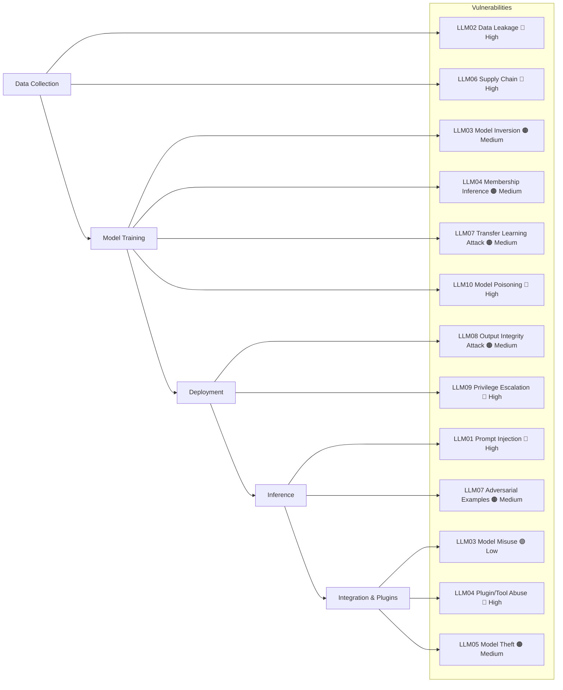

# 🔟 OWASP GenAI / LLM Top 10 (2026)

This table summarizes the **Top 10 vulnerabilities for Generative AI and LLM systems** as identified by OWASP (2026).  
It includes descriptions, examples, mitigations, and reference links.

## Summary Table:

| **LLM ID** | **Title**                  | **Description**                                                                 | **Examples of Vulnerabilities**                                                                 | **Mitigation**                                                                 | **Reference Links** |
|------------|-----------------------------|---------------------------------------------------------------------------------|-------------------------------------------------------------------------------------------------|---------------------------------------------------------------------------------|---------------------|
| LLM01      | Prompt Injection            | Malicious user input overrides system or developer instructions.                 | Forcing a translation model to output attacker‑defined text instead of the intended translation. | Guardrails, input sanitization, external filters.                               | [Bearer CLI Rules](https://docs.bearer.com/reference/rules) |
| LLM02      | Data Leakage                | Sensitive information unintentionally revealed in outputs.                        | Chatbot exposing API keys or internal system prompts.                                           | Output filtering, redaction, monitoring.                                        | [SecureFlag Knowledge Base](https://knowledge-base.secureflag.com/vulnerabilities/nosql_injection/nosql_injection_vulnerability.html) |
| LLM03      | Model Misuse                | Using LLMs for harmful or unintended purposes.                                   | Generating phishing emails or disinformation campaigns.                                         | Usage policies, abuse monitoring, restricted access.                            | [OWASP AI Security Top 10](https://resources.navesecurity.com/fda-documentation-checklist-641102) |
| LLM04      | Plugin / Tool Abuse         | Exploiting integrations with external systems.                                   | Malicious prompts triggering unauthorized API calls via plugins.                               | Sandboxing, strict allow‑listing, monitoring.                                   | [Nave Security FDA Checklist](https://resources.navesecurity.com/fda-documentation-checklist-641102) |
| LLM05      | Model Theft / Extraction    | Replicating model behavior via repeated queries.                                 | Querying a commercial LLM to build a clone model.                                               | Rate limiting, watermarking, API monitoring.                                    | [Microsoft Learn Unsafe Code](https://learn.microsoft.com/en-us/dotnet/csharp/language-reference/unsafe-code) |
| LLM06      | Supply Chain Vulnerabilities| Exploiting weaknesses in pre‑trained models or dependencies.                      | Compromised open‑source embeddings or poisoned datasets.                                        | Integrity checks, signed models, secure repositories.                           | [Bearer CLI Rules](https://docs.bearer.com/reference/rules) |
| LLM07      | Adversarial Examples        | Crafted inputs mislead LLMs into incorrect outputs.                              | Specially formatted text causing misclassification or hallucinations.                          | Adversarial training, robustness testing.                                       | [IBM ART](https://github.com/Trusted-AI/adversarial-robustness-toolbox) |
| LLM08      | Output Integrity Attack     | Manipulating model outputs before they reach the user.                           | Intercepting chatbot responses and altering them in transit.                                    | Secure channels, cryptographic integrity checks.                                | [SecureFlag Knowledge Base](https://knowledge-base.secureflag.com/vulnerabilities/nosql_injection/nosql_injection_vulnerability.html) |
| LLM09      | Privilege Escalation        | Prompt injection modifies system configurations or permissions.                  | Enabling hidden settings like `"chat.tools.autoApprove": true` in Copilot.                      | Least privilege, config hardening, audit trails.                                | [OWASP AI Security Top 10](https://resources.navesecurity.com/fda-documentation-checklist-641102) |
| LLM10      | Model Poisoning             | Manipulating model weights to degrade performance or create backdoors.           | Altering neural network parameters to force misclassification.                                 | Secure training pipelines, integrity monitoring.                                | [Nave Security FDA Checklist](https://resources.navesecurity.com/fda-documentation-checklist-641102) |

---

## 🔄 Vulnerabilities Across Lifecycle (with Severity)

---
## Comparison of OWASP Top 10 2025 vs OWASP Top 10 2026

---

**Reference:** genai.owasp.org/download/56857/?tmstv=1785822482
