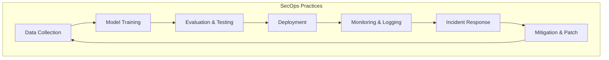

#  ⚙️ AISecOps / MLSecOps / LLMSecOps

Operational practices for embedding security into AI/ML/LLM workflows:
- **AISecOps**: Security practices across AI systems
- **MLSecOps**: Secure ML lifecycle (data, training, deployment)
- **LLMSecOps**: Guardrails, monitoring, and defenses for LLMs
- Focus on **continuous monitoring**, **incident response**, and **secure deployment pipelines**

---
## 🔄 Workflow Diagram

<table>
  <thead>
    <tr>
      <th style="background-color:#0078D7;color:white;">⚙️ Phases</th>
      <th style="background-color:#2B88D8;color:white;">🔒 SecOps</th>
      <th style="background-color:#00B294;color:white;">🧠 Description</th>
      <th style="background-color:#FFB900;color:white;">🧰 Tools</th>
    </tr>
  </thead>
  <tbody>
    <tr>
      <td>💡 <b>Design</b></td>
      <td>Secure Design</td>
      <td>Contextual and Predictive AI Threat Modeling</td>
      <td>AI Village, LLM Threat Modeling, Agent‑Wiz</td>
    </tr>
    <tr>
      <td>🧩 <b>Model Training & Evaluation</b></td>
      <td>Secure Data</td>
      <td>Adversarial Tests</td>
      <td>ModelScan, Safetensors, IBM ART, OpenDP</td>
    </tr>
    <tr>
      <td>💻 <b>Development</b></td>
      <td>Secure Coding</td>
      <td>SAST & CI Security</td>
      <td>GitLeaks, Semgrep, Linting Tools</td>
    </tr>
    <tr>
      <td>🏗️ <b>ML Build</b></td>
      <td>Secure Packaging</td>
      <td>Supply Chain Attack (Trivy, HardenRunner)</td>
      <td>Trivy, HardenRunner, BomLens, OWASP Dependency Checker</td>
    </tr>
    <tr>
      <td>🧪 <b>ML Test</b></td>
      <td>Secure Scans</td>
      <td>Penetration Testing, Prompt Injection, OWASP Top 10</td>
      <td>BurpSuite, Garak</td>
    </tr>
    <tr>
      <td>🚀 <b>Release</b></td>
      <td>Secure Transfer</td>
      <td>Package Signing, Image Sharing</td>
      <td>Cosign, Notary</td>
    </tr>
    <tr>
      <td>📦 <b>ML Deployment</b></td>
      <td>Secure Deploy</td>
      <td>Container Security, Access & Config Management</td>
      <td>MLSploit, Trivy, Clair, Checkov, Isovalent, Microsoft AI Red Teamer</td>
    </tr>
    <tr>
      <td>🛡️ <b>Audit & Maintenance</b></td>
      <td>Security Audit & Monitor</td>
      <td>Continuous Monitoring, Patching, WAF, Red Teaming</td>
      <td>WAF, PromptFoo Scanner, TrustGate</td>
    </tr>
  </tbody>
</table>

---

## 🛡️ Secure AI Model Ops Cheat Sheet (OWASP)

### 📘 Overview
The **OWASP Secure AI/ML Model Ops Cheat Sheet** provides practical security guidance for operating and deploying **AI/ML systems**, including traditional machine learning models and **Large Language Models (LLMs)**.  
It helps **MLOps, DevOps, and security teams** protect the model lifecycle from development to production, addressing threats such as **data poisoning**, **adversarial input**, **model theft**, and **operational abuse**.

### ⚠️ Common Security Issues
| **Threat** | **Description** |
|-------------|-----------------|
| **Data Poisoning** | Attackers inject malicious data into training datasets to manipulate model behavior. |
| **Model Inversion & Extraction** | Attackers reconstruct training data or extract model parameters via inference queries. |
| **Adversarial Examples** | Slightly modified inputs mislead model predictions without visible changes. |
| **Prompt Injection** | Malicious input overrides LLM instructions or leaks system prompts. |
| **Unsecured APIs** | Public inference endpoints lacking authentication or rate limiting. |
| **Hardcoded Secrets** | Sensitive credentials (API keys, tokens) embedded in source code. |
| **Unvalidated Third-party Models** | External pre-trained models used without integrity verification. |
| **Open Artifact Stores** | Misconfigured storage exposing model binaries or datasets. |
| **Lack of Monitoring & Drift Detection** | No systems to detect shifts in model behavior or data distribution. |
| **Orphaned Deployments** | Deprecated models left accessible in production environments. |
| **Weak Runtime Isolation** | Shared infrastructure allows cross-tenant data exposure or unauthorized access. |

<table>
  <thead>
    <tr>
      <th style="background-color:#0078D7;color:white;">🧠 Category</th>
      <th style="background-color:#2B88D8;color:white;">🔒 Key Practices</th>
      <th style="background-color:#00B294;color:white;">🧰 Details / Examples</th>
    </tr>
  </thead>
  <tbody>
    <tr>
      <td>💡 <b>Model Development & Training</b></td>
      <td>Version-controlled, auditable pipelines</td>
      <td>Use MLFlow, DVC; validate and sanitize training data; apply differential privacy or anonymization; train in reproducible, containerized environments</td>
    </tr>
    <tr>
      <td>🔑 <b>Secrets & Configurations</b></td>
      <td>Secure secret management</td>
      <td>Never hardcode secrets; use AWS Secrets Manager, HashiCorp Vault, or CI secret injection; store credentials in environment variables</td>
    </tr>
    <tr>
      <td>📦 <b>Model Storage & Artifacts</b></td>
      <td>Controlled model storage</td>
      <td>Store models in access-controlled registries; sign binaries with digital signatures; encrypt model weights and datasets; validate third-party models before production</td>
    </tr>
    <tr>
      <td>🌐 <b>Inference API Security</b></td>
      <td>Harden inference endpoints</td>
      <td>Enforce authentication, input validation, and rate limiting; use structured prompt templates for LLMs; implement circuit breakers; monitor telemetry and alert on anomalies</td>
    </tr>
    <tr>
      <td>🏗️ <b>Deployment & Infrastructure</b></td>
      <td>Secure CI/CD and environment isolation</td>
      <td>Harden containers (distroless images, AppArmor); integrate security scanning in CI/CD; apply least privilege permissions; isolate dev, staging, and production environments</td>
    </tr>
    <tr>
      <td>🖥️ <b>Runtime & Hardware Isolation</b></td>
      <td>Workload and hardware separation</td>
      <td>Separate workloads by trust boundary; use microVMs, gVisor, Kata Containers, or confidential compute; clear temporary files; monitor isolation failures and unauthorized access</td>
    </tr>
    <tr>
      <td>📊 <b>Monitoring & Logging</b></td>
      <td>Continuous model observability</td>
      <td>Track input distribution, output entropy, and latency; detect drift via statistical analysis or shadow models; log requests with traceability; alert on scraping or injection attempts</td>
    </tr>
    <tr>
      <td>🧪 <b>Adversarial Robustness</b></td>
      <td>Resilience against adversarial attacks</td>
      <td>Include adversarial examples in testing; use adversarial training and input denoising; deploy shadow models and canary releases for safe rollout</td>
    </tr>
    <tr>
      <td>🛡️ <b>Incident Response & Governance</b></td>
      <td>Governance and rollback mechanisms</td>
      <td>Define escalation procedures for model abuse or drift; implement rollback mechanisms; map threats to OWASP ASVS, Proactive Controls, and NIST AI RMF</td>
    </tr>
  </tbody>
</table>

---

---

## MLSecOps implementation using AWS:
[MLSecOps with AWS](https://d2908q01vomqb2.cloudfront.net/f1f836cb4ea6efb2a0b1b99f41ad8b103eff4b59/2023/11/22/ML-11308-arch-diag.png)

---

### References:
- [MLSecOps with AWS](https://d2908q01vomqb2.cloudfront.net/f1f836cb4ea6efb2a0b1b99f41ad8b103eff4b59/2023/11/22/ML-11308-arch-diag.png)
- [Awesome-MLSecOps](https://github.com/RiccardoBiosas/awesome-MLSecOps#ml-code-security)
- [AI Sec Ops Cheat sheet](https://cheatsheetseries.owasp.org/cheatsheets/Secure_AI_Model_Ops_Cheat_Sheet.html)
- [Microsoft AI Red Teamer](https://learn.microsoft.com/en-us/security/ai-red-team/)
- OWASP LLM Prompt Injection Cheat Sheet  
- NIST AI Risk Management Framework  
- Microsoft Responsible AI Guidelines  
- MITRE ATLAS Framework

